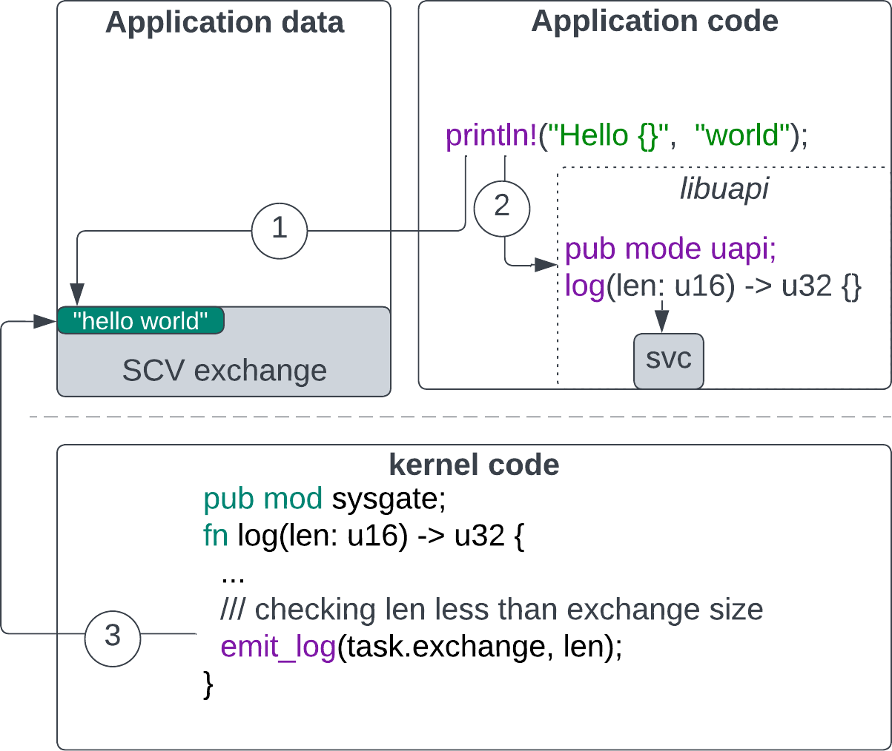
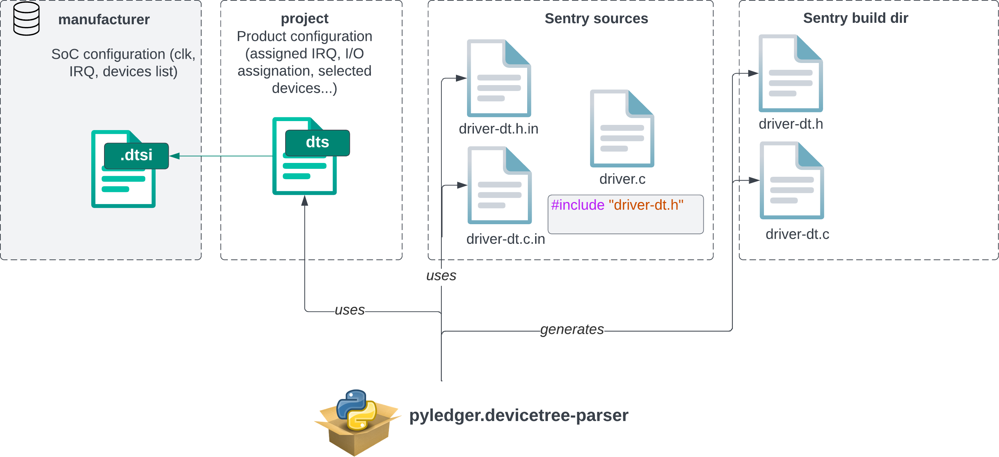
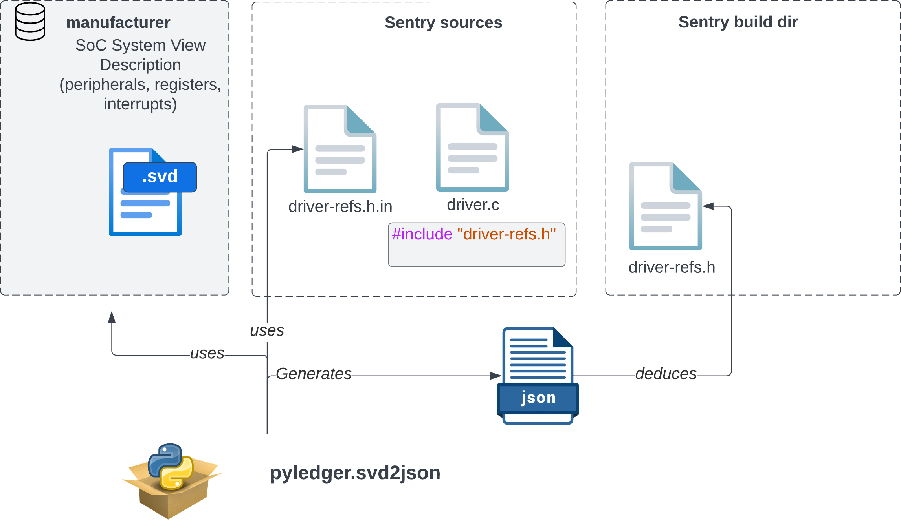

Architectural model
-------------------

Micro-kernel responsibility
^^^^^^^^^^^^^^^^^^^^^^^^^^^

Sentry kernel is a micro-kernel, meaning that it is responsible for few things on
the platform. The micro-kernel is responsible for:

   * Initialize the platform
   * ensure task partitioning
   * ensure task scheduling policy

As a supervisor component, the kernel must protect itself and the ressources it
is responsible of against logical attacks. In the same time, it must as much as
possible detect any external invalid behaviors, in order to be able to react as
much as possible to various exploitation such as fault injection, hardware corruption,
and so on.

Micro-kernel design: handles
^^^^^^^^^^^^^^^^^^^^^^^^^^^^

.. _handles:

Sentry API is build in order to use as much as possible the build system, reducing
runtime complexity.
Based on this concept, all the Operating System objects have a formally specified identifier
denoted *handle*. These handles are opaques that are shared between userspace and kernelspace
in order to identify a ressource. Handles are forged at build time.

In Sentry, the following ressource handles exist:

   * **inth_t: interrupt handle**: Identify an interrupt line, from any interrupt controller. This
     include, for example, both NVIC interrupts ad external GPIO triggered interrupts lines.

   * **sigh_t: signal handle**: Identify a signal and its source. A signal is a typed data-less event
     that can be emitted by a job or the kernel itself. It does not hold any data other that the
     signal type itself and the signal source.
     Signal source correspond to the task label only, meaning that the job id is not transmitted.
     When the source is equal to 0, this means that the kernel is the source of the signal.

   * **ioh_t: I/O line**: Identify a SoC I/O line. Typically a GPIO pin/port couple, associated to
     a given configuration (direction, speed...).

   * **ipch_t: IPC handle**: Identify an IPC that have been received by the current job. This handle
     only exist for the current job and hold informations such as the IPC message and source. This
     handle is ephemeral and is used only for message reception.

   * **devh_t: device**: Identify a (memory-mapped) device. All other informations, generated from
     device tree, are forged in the userspace device driver build system and the device manager
     listing (see bellow).

   * **taskh_t: task**: Identify a task (and a task job in the same handle). Allows IPC communication.
     A part of the handle is dynamic to support job respawn. Through this feature, natural usage of
     handles in IPC communication will naturally generate errors in case of peer respawn as the job
     identifier as changed.

   * **shmh_t: task**: Identify Shared memory. A shared memory is a memory region declared at built time that
     has a `taskh_t` owner. A SHM can be shared with another `taskh_t` and have dedicted associated permissions
     set only the SHM owner can define.
     In terms of mapping, SHM are under the control of the memory manager (see below).

   * **dmah_t: DMA stream**: A DMA stream is a DMA configuration associating a source, a destination,
     a copy model (circular, etc.), and all related DMA-specific configuration except the stream assignation
     to a DMA controller. Most of DMA streams can be assigned to multiple DMA channels and their assignation
     varies depending on the controller usage. Assignation is under kernel responsibility, but streams
     are userspace needs. Again, streams are build-time declared and shared with the kernel so
     that the kernel can validate the handle integrity and ownership at runtime easily.

.. note::

  More about handles and the way they are used in described in the UAPI :ref:`handles <uapi_handles>` usage
  subchapter

Other userspace/kernelspace communication concepts
^^^^^^^^^^^^^^^^^^^^^^^^^^^^^^^^^^^^^^^^^^^^^^^^^^

.. _svc_exchange:

In Sentry, the kernel API is built in order to reduce as much as possible the
need for data transfer. Sentry is a kernel in which there is never a single pointer
transmitted between kernelspace and userspace.

To achieve that, any non-scalar data that need to be transfered from user to kernel or
from kernel to user is done using a dedicated preconfigured memory section.

This section, denoted `svc_exchange`, is a small section in which the userspace task
write any input data required by the corresponding Sentry syscall before entering
supervisor mode.
In the very same way, any kernel data that need to be emitted to the userspace task
is delivered through a kernel write access in this very same section.

A typical use of such an area is the following:

  Exchange sequence when emitting logs

The main advantage of using a fixed echange zone is that the kernel do not need anymore a write access
to the task data section. Considering that, the very first action of the kernel interrupt
handler is to unmap the task, keeping only its `svc_exchange` zone mapped.
In such mode, the kernel is no more a powerful god but what it should always be:
a basic manager.
Moreover, user task, never, at any time, uses pointers when communicating with the kernel.

`svc_exchange` based usersace/kernelspace communication for non-scalar data implies somme constraints:

   * Any data written in the `svc_exchange` by the application may be overriden by the kernel syscall
     when returning from the syscall. As a consequence, the region content is ephemeral

   * Any kernel-transmitted data other than the syscall return type, even scalar ones, are transmitted
     through the `svc_exchange` area, meaning that there is no pointer arguments in syscalls used in order
     to get back kernel results

.. note::
   `svc_exchange` region size is a project build time specified value, so that the amount
   of content a userspace task can transmit to the kernel through this region (and the opposite
   direction) can vary, depending on the project needs.

Micro-kernel design for portability
^^^^^^^^^^^^^^^^^^^^^^^^^^^^^^^^^^^

Global hierarchy
""""""""""""""""

The Sentry kernel is designed and architectured in order to be fully portable.
Its architecture is build under three main components famillies:

   * architecture-related support (a.k.a. ASP), which correspond to an arch-specific,
     yet SoC-generic support, such as, for e.g. MPU, Systick and NVIC support for ARMv7M,
     but also the handlers entrypoints

   * Board-related support (a.k.a. BSP), which correspond, in a micro-kernel, mostly
     to a small set of SoC drivers. These drivers must be as reduced as possible and
     needed for platform boot stage and to ensure efficient task partitioning (e.g.
     DMA drivers, while no SDMA is supported in ARMv7M or ARMv8M by now)

   * non-HW relative parts of the kernel, which include syscalls implementation and in our
     case the scheduler

In order to keep a portable enough architecture, all arch-relative or board-relative
component is hidden under generic abstraction layers denoted *managers*.

There are multiple managers in Sentry:

   * **Memory manager**: This manager is responsible for configuring the memory protection
     and delivering a portable high level API for manipulate memory such as mapping and
     unmapping Outpost ressources into the context of a Sentry subjet (for example a task).
     This API comply with armv7m MPU as well as RISC-V MPU or even MMU model. The memory manager
     access `devh_t` handles to map userspace devices, and is responsible for mapping
     abstracted blocks such as task code, data, kernel code and data.

   * **device manager**: This manager is responsible for manipulating devices owned by userspace
     tasks. All Sentry syscalls that manipulate devices interact with this manager for tasking
     informations about devices (address, size, abstracted clocking config, etc.). This manager is
     also responsible for authenticating `devh_t` handles given by userspace and acknowledge the
     device owner.

   * **task manager**: This manager is responsible for discovering the task deployed on
     the system at bootup, checking their authenticity and various informations, and map them
     in the system memory. The task manager interact with the scheduler to `schedule()` the task
     job when needed, and store locally all the task metainformation.
     The task manager is responsible for all job boostrapping, termination, and scheduling.

   * **io manager**: This manager is responsible for I/O configuration, using `ioh_t` as typical
     argument. It is responsible for probbing and (re)configuring the underlaying I/O controller,
     setting the I/O pins and ports accordingly and authenticating the `ioh_t` handle and owner.

   * **interrupt manager**: This manager is responsible for interrupts (except core interrupts).
     This manager is using `inth_t` as typical argument and is responsible for manipulating the
     corresponding interrupt line (being an internal or external line, in interaction with the
     I/O manager in this later case).

   * **debug manager**: This manager is built in debug mode only. This manager activate the debug
     features of Sentry, including functions such as serial console, kernel logs and userspace logs.

   * **dma manager**: This manager is responsible for authenticating `dmah_t` handles and owner, and
     to configure, start, and stop DMA streams. It is also called by the underlaying BSP DMA driver
     interrupts and dispatch stream-related information to the correct stream owner.

   * **clock manager**: This manager is a little appart as it is also associated to the platform bootup
     time. This manager is responsible for initiate the plateform clocking configuration and also
     delivers an upper layer portable API to other managers and kernel BSP in order to support
     device (un)clocking. There is no direct clocking configuration through Sentry syscall API, but
     instead abstracted API, so that clocks identifiers is never even known from the userspace. Any
     device bus and clock identifier is a full kernel-side information associated to `devh_t` in the
     device manager.

.. figure:: ../_static/figures/managers.png
   :width: 80%
   :alt: Sentry managers hierarchy in syscall usage
   :align: center

   Managers and their interactions

SVD and Device-trees
""""""""""""""""""""

SVD (System View Description) is initially a ARM specifictation (CMSIS-SVD) influenced by IP-XACT designed
in order to define the programmer's view of a device. Now also used in the RISC-V ecosystem, SVD files
are XML-based definition of the overall devices, registers, interrupts, and any other hardware components that
are accessible for a given target (mostly system on chips).

A typical SVD definition extract is the following:

.. code-block:: xml
  :linenos:

  <peripheral>
    <name>RCC</name>
    <description>Reset and clock control</description>
    <baseAddress>0x40023800</baseAddress>
    <addressBlock>
      <offset>0x0</offset>
      <size>0x400</size>
      <usage>registers</usage>
    </addressBlock>
    <registers>
      <register>
        <register>
        <name>AHB3ENR</name>
        <displayName>AHB3ENR</displayName>
        <description>AHB3 peripheral clock enable
        register</description>
        <addressOffset>0x38</addressOffset>
        <size>0x20</size>
        <access>read-write</access>
        <resetValue>0x00000000</resetValue>
        <fields>
          <field>
            <name>FMCEN</name>
            <description>Flexible memory controller module clock
            enable</description>
            <bitOffset>0</bitOffset>
            <bitWidth>1</bitWidth>
          </field>
        </fields>
      </register>
      <!-- continuing.... -->

In embedded systems, manufacturers delivers SVD files. While big SoCs (such as IMX.8 for e.g.) may have some
errors (mosty bad mapping) in their SVD files, MCUs SVD files are clean, and ST is a good student in term of
SVD delivery for its own SoCs. A lot of manufacturers deliver their SVD, and the SVD dictionary is hosted in
`github <https://github.com/cmsis-svd/cmsis-svd>`_.

Device-tree is a formal definition of a hardware initially defined as a part of the Open Firmware
definition proposed by IEEE in IEEE 1275-1994. While Open-Firmware IEEE definition was withdrawn in 2005,
device-tree model is though largely adopted, for various usage such as UEFI, various BIOS implementations,
U-Boot, Linux kernel, Grub, Zephyr, Coreboot and so on. They defines informations such as the list
of existing devices in a SoC, their interrupt assignation, clock(s) assignation, possible associated
I/O configuration for (devices interacting with SoC I/O), and various SoC and board-specific informations
that can be used by the software in order to properly configure the underlying hardware.

A typical device tree definition is the following:

.. code-block:: dts
  :linenos:

  usart1: serial@40011000 {
    compatible = "st,stm32-usart", "st,stm32-uart";
    reg = <0x40011000 0x400>;
    clocks = <&rcc STM32_CLOCK_BUS_APB2 0x00000010>;
    resets = <&rctl STM32_RESET(APB2, 4U)>;
    interrupts = <37 0>;
    status = "disabled";
  };

Sentry kernel is using both SVD and device trees in order to optimize its portability and maintainability.
Most of projects use runtime-based dtb (device tree blob) binary objects parser in order to support drivers
configuration. Although, in small embedded systems, such behavior is not a good methodology as it consume too
much memory.
Projects such as `Zephyr <https://www.zephyrproject.org/>`_ already use device trees at build time only, generating
source code instead of importing device tree blob directly.
This remove the ability to dynamically upgrade the device tree configuration, when using device trees
for project-related configurations that may vary (Android model), but this is, in small embedded systems,
not a problem. Instead, source files describing the current board configuration is generated and included
in the source set, in which all project-relative informations are stored, so that device driver's implementation
can stay SoC and board generic.
With such a model, given an IP that exist in multiple SoCs and with various configuration depending on the way
the SoC is integrated to multiple board releases, only the device tree changes, keeping the Senty kernel sources
unmodified.

In Sentry kernel SVD and DTS files are used for the following:

* **kernel drivers (DTS usage)**: Sentry kernel drivers uses device trees in order to be informed of various platform relative
  informations such as:

   * device base address on current SoC
   * device size (needed for device memory mapping)
   * device needed clocks information
   * device pinmuxing (I/O configuration on current board)
   * device assigned interrupts
   * potential SoC-specific values (number of clocks for RCC, number of EXTI for EXTI driver, etc.)
   * potential project specific selection (which USART is selected for debug on current board release?)

  All these informations are generated and stored in a descriptor associated to a descriptor accessor, so that the driver
  can access all these fields as if it is an external configuration.

   Usage of DTS file in Sentry kernel driver

* **kernel drivers (SVD usage)**: All drivers need that the corresponding device definition, including registers list,
  registers fields, registers offset information (relative to device base address defined in the device tree),
  register access rights, etc. Most of the volume of a device driver hold such declaration and is error prone.
  Instead of *writing* such content, it is generated directly from the SVD file, so that the driver can directly use it
  without requiring any hardware IP content definition at driver implementation time from the developer.
  Moreover, in case the IP has some variations (fields that slightly move in a given register, having their mask and
  shift varying between SoCs), these variations are transparent to the driver developer while the field name stays
  the same.

   Usage of SVD file in Sentry kernel drivers

* **IRQ list (SVD usage)**: The list of platform supported IRQ is generated using the SVD file where they are all
  listed with their identifier. Each SoC as a dedicated IRQ list that varies depending on the way the manufacturer
  has connected all devices integrated in the SoC. To ensure that the canonical name and the effective identifier
  of all IRQs is properly defined, it is built upon the SVD file definition.

* **Vector table (SVD usage)**: The vector table is used by the core in order to know which peace of code is executed
  at startup and for each hardware interrupt and core exception (memory fault, usage fault, etc.). This table address,
  (defaulting to `0x0` on ARM) can also be upgraded (typically when moving from a boot-loader to a kernel).
  Like the IRQ list, this table content varies depending on the SoC devices list. Moreover, some interrupts may
  be under the kernel control (e.g. DMA controller's one) while others need to be pushed back to userspace. To generate a
  clean interrupt table with a well knowledge of the corresponding interrupt and with a correct size, the table is forged
  based on the SVD file informations.

* **Device manager dev table (DTS usage)**: The list of project-configured devices is forged from the project dts file.
  This file, which is unique for the overall project, is the aggregation of all userspace drivers and the kernel device tree
  fragments, in which each one declare the device(s) it owns. Based on this unique input, we can define the following:

     * which device is currently used in the project
     * for all used devices, what is its chosen configuration (pinmux, clock, etc.)
     * for all devices, who is the owner (kernel, when the device was a part of the kernel fragment) or user task
     * for all devices, what is the associated required capability. Capability is based on device *familly*, and as such,
       the dts `compatible` field is used to determine the familly and thus the capability required

  With such a materials, a static const table, that hold only active devices for the project, is generated in the device manager
  so that it can lookup various information each time a request is made. The `devh_t` handle is also forged in a predicable
  way so that it is added in this very same table, for lookup resolution.
