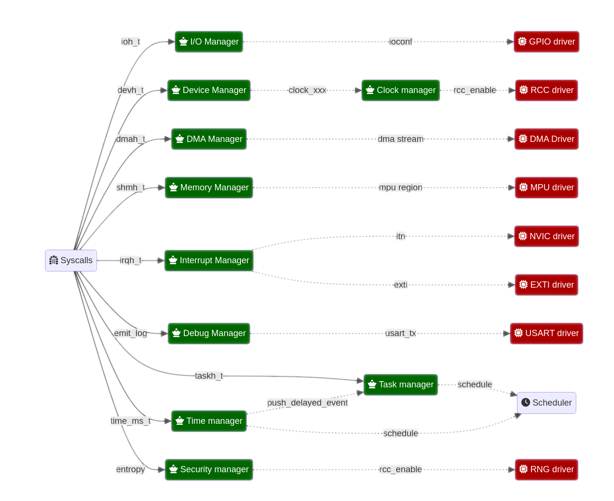

Architectural model
-------------------

Micro-kernel responsability
^^^^^^^^^^^^^^^^^^^^^^^^^^^

Sentry kernel is a micro-kernel, meaning that it is responsible for few things on
the platform.

The micro-kernel is responsible for:

   * Initialize the platform
   * ensure task partitioning
   * ensure task scheduling policy

As a supervisor component, the kernel must protect itself and the ressources it
is responsible of against logical attacks. In the same time, it must as much as
possible detect any external invalid behaviors, in order to be able to react as
much as possible to various exploitation such as fault injection, hardware corruption,
and so on.

Micro-kernel design: handles
^^^^^^^^^^^^^^^^^^^^^^^^^^^^

Sentry API is build in order to use as much as possible the build system, reducing
runtime complexity.
Based on this concept, all the Operating System objects have a formally specified identifier
denoted *handle*. These handles are opaques that are shared between userspace and kernelspace
in order to identify a ressource. Handles are forged at build time.

In Sentry, the following ressource handles exist:

   * **inth_t: interrupt handle**: Identify an interrupt line, from any interrupt controller. This
     include, for example, both NVIC interrupts ad external GPIO triggered interrupts lines.

   * **ioh_t: I/O line**: Identify a SoC I/O line. Typically a GPIO pin/port couple, associated to
     a given configuration (direction, speed...).

   * **devh_t: device**: Identify a (memory-mapped) device. All other informations, generated from
     device tree, are forged in the userspace device driver build system and the device manager
     listing (see bellow).

   * **taskh_t: task**: Identify a task (and a task job in the same handle). Allows IPC communication.
     A part of the handle is dynamic to support job respawn. Through this feature, natural usage of
     handles in IPC communication will naturally generate errors in case of peer respawn as the job
     identifier as changed.

   * **shmh_t: task**: Identify Shared memory. A shared memory is a memory region declared at built time that
     has a `taskh_t` owner. A SHM can be shared with another `taskh_t` or given without access, allowing
     a task A to give a task B a shared memory transfer access, so that B can pass the mapping access to C later.
     Shared memories are under the control of the memory manager (see below).

   * **dmah_t: DMA stream**: A DMA stream is a DMA configuration associating a source, a destination,
     a copy model (circular, etc.), and all related DMA-specific configuration except the stream assignation
     to a DMA controller. Most of DMA streams can be assigned to multiple DMA channels and their assignation
     varies depending on the controller usage. Assignation is under kernel responsability, but streams
     are userspace needs. Again, streams are build-time declared and shared with the kernel so
     that the kernel can validate the handle integrity and ownership at runtime easily.

Other userspace/kernelspace communication concepts
^^^^^^^^^^^^^^^^^^^^^^^^^^^^^^^^^^^^^^^^^^^^^^^^^^

In Sentry, the kernel API is built in order to reduce as much as possible the
need for data transfer. Sentry is a kernel in which there is never a single pointer
transmitted between kernelspace and userspace.

To achieve that, any non-scalar data that need to be transfered from user to kernel or
from kernel to user is done using a dedicated preconfigured memory section.

This section, denoted `svc_exchange`, is a small section in which the userspace task
write any input data required by the corresponding Sentry syscall before entering
supervisor mode.
In the very same way, any kernel data that need to be emitted to the userspace task
is delivered through a kernel write access in this very same section.

The main advantage of this model is that the kernel do not need anymore a write access
to the task data section. Considering that, the very first action of the kernel interrupt
handler is to unmap the task, keeping only its `svc_exchange` zone mapped.
In such mode, the kernel is no more a powerful god but what it should always be:
a basic manager.

Micro-kernel design for portability
^^^^^^^^^^^^^^^^^^^^^^^^^^^^^^^^^^^

The Sentry kernel is designed and architectured in order to be fully portable.
Its architecture is build under three main components famillies:

   * architecture-related support (a.k.a. ASP), which correspond to an arch-specific,
     yet SoC-generic support, such as, for e.g. MPU, Systick and NVIC support for ARMv7M,
     but also the handlers entrypoints

   * Board-related support (a.k.a. BSP), which correspond, in a micro-kernel, mostly
     to a small set of SoC drivers. These drivers must be as reduced as possible and
     needed for platform boot stage and to ensure efficient task partitioning (e.g.
     DMA drivers, while no SDMA is supported in ARMv7M or ARMv8M by now)

   * non-HW relative parts of the kernel, which include syscalls implementation and in our
     case the scheduler

In order to keep a portable enough architecture, all arch-relative or board-relative
component is hidden under generic abstraction layers denoted *managers*.

There are multiple managers in Sentry:

   * **Memory manager**: This manager is responsible for configuring the memory protection
     and delivering a portable high level API for manipulate memory such as mapping and
     unmapping Outpost ressources into the context of a Sentry subjet (for example a task).
     This API comply with armv7m MPU as well as RISC-V MPU or even MMU model. The memory manager
     access `devh_t` handles to map userspace devices, and is responsible for mapping
     abstracted blocks such as task code, data, kernel code and data.

   * **device manager**: This manager is responsible for manipulating devices owned by userspace
     tasks. All Sentry syscalls that manipulate devices interact with this manager for tasking
     informations about devices (address, size, abstracted clocking config, etc.). This manager is
     also responsible for authenticating `devh_t` handles given by userspace and acknowledge the
     device owner.

   * **task manager**: This manager is responsible for discovering the task deployed on
     the system at bootup, checking their authenticity and various informations, and map them
     in the system memory. The task manager interact with the scheduler to `schedule()` the task
     job when needed, and store locally all the task metainformation.
     The task manager is responsible for all job boostrapping, termination, and scheduling.

   * **io manager**: This manager is responsible for I/O configuration, using `ioh_t` as typical
     argument. It is responsible for probbing and (re)configuring the underlaying I/O controller,
     setting the I/O pins and ports accordingly and authenticating the `ioh_t` handle and owner.

   * **interrupt manager**: This manager is responsible for interrupts (except core interrupts).
     This manager is using `inth_t` as typical argument and is responsible for manipulating the
     corresponding interrupt line (being an internal or external line, in interaction with the
     I/O manager in this later case).

   * **debug manager**: This manager is built in debug mode only. This manager activate the debug
     features of Sentry, including functions such as serial console, kernel logs and userspace logs.

   * **dma manager**: This manager is responsible for authenticating `dmah_t` handles and owner, and
     to configure, start, and stop DMA streams. It is also called by the underlaying BSP DMA driver
     interrupts and dispatch stream-related information to the correct stream owner.

   * **clock manager**: This manager is a little appart as it is also associated to the platform bootup
     time. This manager is responsible for initiate the plateform clocking configuration and also
     delivers an upper layer portable API to other managers and kernel BSP in order to support
     device (un)clocking. There is no direct clocking configuration through Sentry syscall API, but
     instead abstracted API, so that clocks identifiers is never even known from the userspace. Any
     device bus and clock identifier is a full kernel-side information associated to `devh_t` in the
     device manager.

