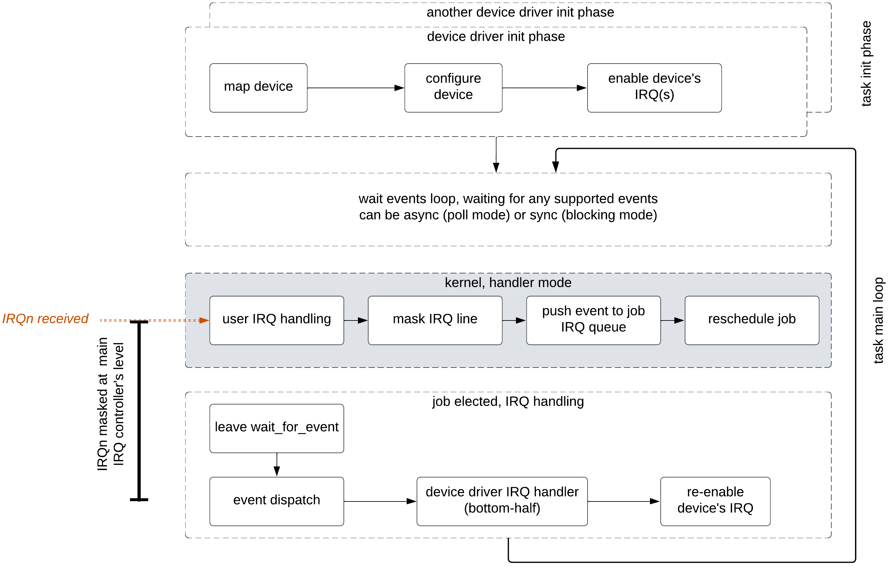

About events
------------

.. _events:

All events (external stimuli) that are received by a job are delivered using the very
same principle:

   * The job call the `sys_wait_for_event()` syscall, in a blocking or non-blocking mode
   * If an event that match the event type(s) requested, the event is pushed back to
     the job's svc_exchange area, using a unified :ref:`header <event header>`, making the
     event being encoded as a datagram, using a dedicated event header
   * The job parse and react the event frame received

The lonely exception to this standard behavior are :ref:`Shared Memories <shm_principles>`, built for performance.

.. _event header:

The unified event header is defined as the following:

   .. code-block:: rust
      :caption: wait_for_event unified header format

      {
         event_type: u8,
         event_length: u8,
         event_magic: u16,
         event_source: u32,
      }

The event header format respects the following fields specification:

   * **event_type**: the event type identifier, as defined in the :ref:`EventType <event_type>` enumerate
   * **event length**: event data length in bytes. The header length is not considered in this field
   * **event_magic**: uniquely defined magic that allows to verify that such a header **is** an event header
   * **event_source**: source of the event, being the kernel (identified by 0) or another job, identified by its
     task handle

.. todo::
    The event header magic is, by now, hardcoded to `0x4242`. The magic value aims to be project-specified instead

Event data is then stored just after the event header.

.. note::
    Event header and data is kept is the native endianess, being little or big depending on
    the current platform endianess. There is no endianess conversion when receiving events

About shared memories
^^^^^^^^^^^^^^^^^^^^^

.. _shm_principles:

.. index::
  single: shared-memory; implementation
  single: shared-memory; definition

Shared memories are a useful communication model that avoid data recopy and regular
user-space/kernel-space exchange when transferring data between tasks. Il also allows
the exchange of potentially bigger data content than classic kernel-based IPC.

Shared memory is built so that jobs can communicate without requiring the kernel to
handle the cata copy. As a consequence, SHM exchanges is fully under the communicating
job control, and do not use at all the kernel/task SVC_EXCHANGE data area, leaving
synchronisation mechanisms to the userspace job.

.. warning::
    As a consequence, there is no such SVC_EXCHANGE based data transmitted, no
    event header nor data emitted, and so on

The way jobs synchronize themselves is under the tasks developer's control. This can
be done using, for example, signals, mutexes, half-duplex mailboxes, and so on.

In Sentry, shared memories are build-time defined at DTS level, meaning that the build
system verify that:

   1. there is enough memory space for building a firmware including all the tasks and
      potentially required shared memories
   2. shared memory mapping complies with the current hardware potential restrictions
      such as alignment or MPU constraints
   3. no shared memory collision exists
   4. each shared memory belongs to an existing task

At DTS level, a typical shared memory definition is the following:

.. code-block:: dts
  :linenos:

  /{
    reserved-memory {
      shm_customtask: memory@2000a000 {
        reg = <0x2000a000 0x256>;
        dma-pool; // DMA allowed from/to this SHM
        outpost,shm;
        outpost,no-map;
        outpost,label = <0xf00>;// shm label, unique
        outpost,owner = <0xbabe>; // task label
      };
    };
  };

A shared memory hold various attributes, some being required, others not:

   * `reg`: (**required**) define the shared memory base address and size
   * `dma-pool`: when used as DMA source or destination. If not, any DMA request that
     targets this shared memory is refused.
   * `outpost,shm`: (**required**) Sentry specific attribute that is used to filter SHMs in reserved memory node
   * `outpost,label`: (**required**) easy, unically existing label that identify this SHM. Allows userspace task to use them
     as canonical names
   * `outpost,owner`: (**required**) defined the SHM owner using the corresponding task label
   * `outpost,no-map`: if defined, the SHM can't be mapped by any task. This permits chained DMA transfers
     that do not require software access

.. note::
  A shared memory may not be shared with any other task if used only for DMA transfers

A shared memory is associated to the following notions:

   * an **owner**, being the task that own the shared memory, being responsible of its usage and sharing
   * a **user**, being the task with which the shared memory is shared

At boot time, a shared memory is shared with no one (no user is defined). The owner has the hability to:

   * get back the SHM handle using the SHM label
   * set the SHM credentials using the SHM handle

A shared memory is associated to credentials. These credentials exist and are independent for both owner
and user tasks. Existing credential flags are defined in Sentry `sys_shm_set_credential()` syscall documentation.

This syscall can be use to set owner's credentials or declare a user with specified credentials.

.. todo::
  SHMv2: Add `sys_shm_share()` to separate credential set from effective sharing
  SHMv2: Add `sys_shm_lock()` to lock SHM credentials so that no more credential configuration can be done for a SHM target

Mapping and unmapping a shared memory is made using the `sys_shm_map()` and `sys_shm_unmap()` syscalls, using the shared
memory handle previously retrieved, if the map permission is allowed.

.. note::
  If the SHM definition in the DTS is declared are not mappable, the MAP permission has no mean and the shared memory is not mappable

If the user task job terminates, the user's credentials are reset and the shared memory is no more shared.
If the owner task job terminates, the owner's credentials are reset, but the user's credentials are kept to avoid any fault transmissions

In both cases, the corresponding peer (being the user or owner task), is informed through a SIGPIPE signal with the peer task handle as
signal source.

More information on the shared memory API is defined in the :ref:`Sentry UAPI <uapi>` definition.

About DMA streams
^^^^^^^^^^^^^^^^^

.. _dma_principles:

.. index::
  single: dma; implementation
  single: dma; definition

DMA streams are objects that are defined at compile-time, so that they can be manipulated at
run-time by the owning task. A stream is a static definition of a DMA channel configuration that
needs to be instantiate at runtime when needed.

Such an object, like other Sentry objects (devices, shared-memory):

   * have a statically defined owner
   * is associated to a capability (`CAP_DEV_DMA`)
   * has a unique label that identify the stream

In DMA stream definition, the ownership is defined at channel level to ensure that there
is no way to share a given DMA channel between tasks, to avoid any potential covert channel

In the same way, DMA streams can't read neither write anywhere in memory. As Sentry has the
notion of `reserved-memory` blocks statically owned by tasks, memory targeting DMA streams
can only read (as source) or write (as target) shared memories that hold the `dma-pool` attribute.
As shared-memories are not shared by default (see :ref:`above <shm_principles>`), it is possible
to control source and destination of a DMA streams in term of ownership.

Sentry supports usual DMA streams types:

   * Memory to memory: DMA copy between shared memories
   * Device to memory: DMA copy from a device rx FIFO and a shared memory
   * Memory to device: DMA copy from a shared memory toward a device tx FIFO
   * Device to Device: DMA copy between chained devices

DMA stream definition must comply with the following specification:

   * `compatible = \"dma-streams\""`: (**required**) define the current block as a dma-stream
   * `channel`: (**reqquired**) target channel identifier, as defined in any activated GPDMA controller
   * `streamid`: when interacting with a device, stream identifier as defined in the GPDMA datasheet that is
     defined for such a device interaction. This value is not validated by Sentry at runtime as it is a
     SoC-specific value
   * `prio`: (**required**): DMA stream priority, as defined in the currently used dt-bindings header
   * `source`: (**required**) Sentry object source, being an existing shared memory or a device, using DTS phandle reference
   * `dest`: (**required**) Sentry object destination, being an existing shared memory or a device using DTS phandle reference
   * `length`: (**required**) amount of bytes to transfer
   * `circular`: when the source or the destination requires a circular write, set circular flag to 1 using `<source dest>` booleans
   * `outpost,label`: (**required**) unique strem identifier to be used when requiring the DMA handle value

.. warning::
   DMA API do not verify target or source memory ownership of a DMA stream for the sake of
   kernel implementation simplicity. As streams are build-time defined, reviewing the device-tree
   is considered instead of enabling run-time complex checks

Multiple DMA streams can target the same DMA channel, while the DMA stream owner is the same for all
streams. The DMA owner stream owner is then responsible for consecutively assign, start, stop and unassign
streams.

.. code-block:: dts
  :caption: typical DMA streams definition
  :linenos:

    dma-streams {
        // memory-to-memory DMA stream
        stream1 {
	        compatible = "dma-stream";
	        channel = <&gpdma1_1>;
	        prio = <STM32_DMA_PRIORITY_HIGH>;
	        source = <&shm__1>;
	        dest = <&shm__2>;
	        length = <0x100>;
	        // no circular, linear for both source and dest
	        outpost,label = <0x2>; // task-level unique DMA identifier
        };

        stream2 {
            compatible = "dma-stream";
            channel = <&gpdma1_1>;
            streamid = <112>; // channel stream (af) identifier
            prio = <STM32_DMA_PRIORITY_MEDIUM>;
            source = <&usart1>;
            dest = <&shm_autotest_1>;
            length = <42>;
            circular = <1 0>; // circular source, linear dest
            outpost,label = <0x1>; // task-level unique DMA identifier
        };
    };

    [...]
    // GPDMA 1 active channels
    &gpdma1 {
	    status = "okay";
	    // About channels that are used
	    gpdma1_1: dma-channel@1 {
		    status = "okay";
		    outpost,owner = <0xbabe>;
	    };
    };

.. note::
    A DMA stream is declared in the root (denoted `/`) section of the device tree

When receiving a DMA stream event, the DMA event is encoded as a u32. DMA event length
is always 4.

DMA event are defined in the `dma.h` header, and respect the following potential values:

.. code-block:: c
  :caption: Sentry DMA events
  :linenos:

  GPDMA_STATE_TRANSMISSION_FAILURE  /**< DMA transmission failure */
  GPDMA_STATE_CONFIGURATION_FAILURE /**< DMA channel configuration failure */
  GPDMA_STATE_OVERRUN               /**< DMA transmission overrun */
  GPDMA_STATE_TRANSFER_COMPLETE     /**< DMA transfer complete for this channel */
  GPDMA_STATE_HALF_TRANSFER         /**< DMA transfer half-complete for this channel */

.. todo::
  properly separate state (returned by get_info/get_status) from events

About signals
^^^^^^^^^^^^^

.. _sig_principles:

.. index::
  single: signal; implementation
  single: signal; definition

Signals is the easiest communiation channel for a task. Signals are asynchronous events a
job may receive in various cases:

   * Another job has emitted a signal that target the current job
   * A system-related event has risen and the kernel has emitted the signal to the current job

In order to differenciate both events type, the source field of the :ref:`event header <event header>`
is used:

   * When the signal is emitted by another job, the corresponding task handle is set as source
   * When the event is emitted by the kernel, the source field of the event header is set to `0`

Sentry supports the following signals that can be canonically used by any task:

.. code-block:: c
    :caption: Sentry supported signals

    SIGNAL_ABORT = 1
    SIGNAL_ALARM,
    SIGNAL_BUS,
    SIGNAL_CONT,
    SIGNAL_ILL,
    SIGNAL_IO,
    SIGNAL_PIPE,
    SIGNAL_POLL,
    SIGNAL_TERM,
    SIGNAL_TRAP,
    SIGNAL_USR1,
    SIGNAL_USR2,

These signals are mapped on a subset of the POSIX PSE51 signals definition, as they well
defined various events that can be used as a control plane implementation between tasks that
interact as a system-level automaton. `USR1` and `USR2` are also defined for other cases that
are not defined by others.

Kernel-related signal-encoded events that may also rise are the following:

   * **SIGNAL_PIPE**: an IPC targetting another job is broken, as, for any reason,
     the other jobs terminates without reading the IPC content. The job is then awoken
     from its blocking `send_ipc()` call with a `STATUS_INTR` return code.

   * **SIGNAL_ALARM**: if the job as requested an alarm scheduling (see :ref:`sys_alarm() syscall <sys_alarm>`),
     this signal is emitted when alarm timeout is reached.

   * **SIGNAL_CONT**: if the system has just leaving a low power mode, the kernel
     emit such a signal to all running jobs.

When receiving a signal event, the signal is encoded as a u8. signal event length
is always 1.

About Interrupts
^^^^^^^^^^^^^^^^

.. _irq_principles:

.. index::
  single: irq; implementation
  single: irq; definition

Interrupts events rise when a given task own a driver that is associated to a
device for which at least one interrupt has been defined in the device tree.

While the current SoC dtsi file, delivered in the
`outpost-devicetree <https://github.com/outpost-os/outpost-devicetree>`_
repository is clean for the device, there is no need to add interrupt related information,
as interrupt assignations is already defined. As a xonsequence, only the device activation
(using the `status = "okay";` standard attribute) is enough.

.. note::
   It is possible to validate that the device is properly specified in the generated
   dts file using, for example, `dts_dump <https://pypi.org/project/dts-utils/>`_

.. code-block:: bash
    :caption: Validating that a device is properly defined

    $ dts_dump subprojects/devicetree/nucleo_u5a5_autotest.dts.pp timers6
    timers6: timers@40001000 {
            compatible = "st,stm32-timers";
            reg = < 0x40001000 0x400 >;
            clocks = < &rcc 0x9c 0x10 >;
            resets = < &rctl 0xe84 >;
            interrupts = < 0x31 0x0 >;
            interrupt-names = "global";
            status = "okay";
            outpost,owner = < 0xbabe >;
            outpost,label = < 0x1f01 >;
            outpost,counter = < 0xffff >;
            outpost,prescaler = < 0x262 >;
            pwm {
                    compatible = "st,stm32-pwm";
                    status = "disabled";
                    #pwm-cells = < 0x3 >;
            };
    };

Using such a configuration, the declared interrupts are assigned to the owning job.
Unmasking an interrupt line is not an automated behavior and is a voluntary action
using the :ref:`sys_irq_enable <sys_irq_enable>` UAPI.

On the other side, when an IRQ that target a user task rise, the kernel voluntary
mask the IRQ line as the effective device IRQ handler is executed in the task context,
and as such behave as a threaded IRQ.
The job is then responsible for:

   * execute the effective ISR routine (such as clearning the device status flag(s))
   * re-enable the IRQ line no that the device event has been properly acknowledged

A typical user-space IRQ handling is described below:

When an IRQ rise, the kernel push the IRQ information at task input queue level and
schedule the job. Although, the job is not elected (i.e. there is no scheduling violation
in the case of IRQ events). As a consequence, the associated latency depend on the job
priority and quantum. This, depending on the configuration, generates latency in the election
of the IRQ handling thread.

There are times when multiple IRQn are waiting in the current task input queue.
In that case, the job can received, in a single wait_for_event call, multiples IRQs.

This allows the job to decide with which priority/hierarchy all IRQn should be treated.

.. todo::
    By now, sentry only push one interrupt at a time

When receiving an IRQ event, the IRQn value is encoded as a u32. IRQ event length
is always a multiple of 4, depending on the number of waiting interrupt(s) that
have been pushed to the user
