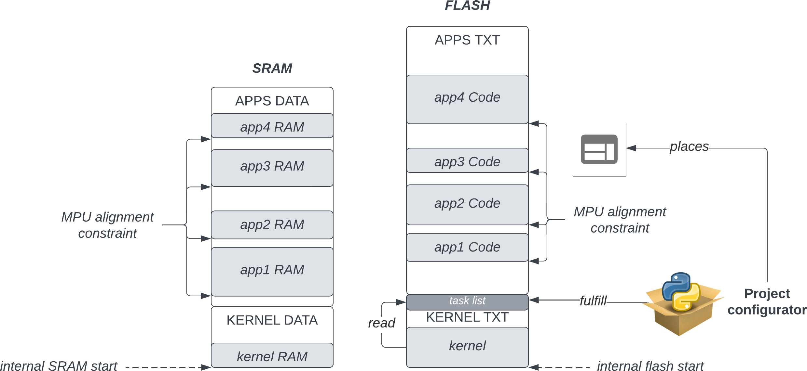

Initial conception model
------------------------

.. index::
   single: micro-kernel; principle

Micro-kernel design
^^^^^^^^^^^^^^^^^^^

Sentry (and more generaly Outpost) is based on a micro-kernel model. Such a
model considers that the less the supervisor code handles, the better the overall
architecture is enforced. To achieve that, this requires some specific considerations:

   * some devices (short-listed number) must still be under the control of the kernel,
     because their configuration is required at very early boot time or because their
     access is particulary security critical
   * all other devices are under the responsibility of userspace tasks, meaning that
     they will directly manage them as if they were a part of the kernel, but yet
     fully partitioned and executed in user mode

The userspace device manipulation concept is fully described in a :ref:`dedicated chapter <userspace_devices>`.

.. index::
   single: application; model
   single: library; model
   single: micro-service; model

Application developer model
^^^^^^^^^^^^^^^^^^^^^^^^^^^

In small embedded systems, nearly all services are related to a given hardware
backend (graphical stack, cryptographic service, I/O stack, etc.).

Although, value-added functions should be decorelated from hardware-related functions,
while the latter is able to deliver an interface to such a hardware through an abstracted
API.
This model allows two things:

   * The Value Added developer does not always need to be expert in hardware related functions
     to implement the effective VA.

   * Hardware-related micro-services are fully reusable functions that can be reusables
     and shared between projects. Theses services can be integrated based on two modes:

      * **library model**: the hardware driver delivers a portable, easy to understand upper API
        that the application developer can directly use as a library in its application. This is,
        typically, the Rust `trait` design model.

      * **micro-service model**: the hardware driver is integrated into a dedicated task that
        delivers a portable and easy to use API to other application through inter-process
        communication, potentially allowing multiple higher level services to communicate
        with it. Partitioning between backend and VA function is increased by the kernel, but
        full chain execution latency is increased.

Sentry design is made so that both models are natively supported, so that the user VA
developers team can, if needed, design a task hierarchy model with full separation between
backend developers and business function developers.

Moreover, Sentry and its UAPI are designed to support, for business functions:

   * the Rust libcore and libstd environment for Rust developers
   * POSIX compliance for C developers (in a separated userspace POSIX PSE51-2001 support library)

This is a voluntary model for two reasons:

   * *easier functional testing*: The business function developer is able to test and execute its function on any
     host that support Rust libstd or POSIX API without requiring embedded target build nor emulation, without
     any modification of the source code.

   * *easy mocking*: Any backend driver implementation should be able to fully mock the hardware,
     yet respecting the upper API, when testing the business logic (typically, a graphical stack
     backend should be able, on Linux/x86_64, to delivery a full SDL-backed
     support so that any upper business logic graphical rendering is executed with
     the very same result on the build host)

For a given application, only race conditions and performances analysis require testing
on the real target, while interfaces are properly defined and tested.

With this metodology achieved, the business logic developer does not require:

   * Sentry-specific API expertise (Rust or POSIX API usage instead)
   * embedded system low-level expertise (platform bootup, memory map, device drivers design...)

In the same way, the business logic developer can:

   * use API he knows (POSIX or Rust standard APIs)
   * natively test and execute business logic application out of the embedded system
   * natively debug business logic functional implementation (native gdb, easy IDE integration)

The residual constraint is the analisys of the overall system performances,
that define how multiple tasks can interact with optimal performances and scheduling. The following
chapter describes the Sentry tasking model, in order to respond to this part.

.. index::
   single: scheduling; principle
   single: task; definition
   single: job; definition
   single: label; definition
   single: task handle; definition

About general tasking model
^^^^^^^^^^^^^^^^^^^^^^^^^^^

The scheduling concept
""""""""""""""""""""""

Sentry is a preemptive kernel that executes partitioned userspace tasks.
Each task holds a single thread, built to use a single blocking point on which it
listens to various events:

   * hardware interrupts
   * inter-process communication
   * signals

The Sentry kernel may support different schedulers, but the target production scheduler is
a Round-Robin multiqueue shheduler with quantum (RRMQ) management.
Such a scheduler supports multiple queues based on each task priority, and
manipulate each job predefined quantum when the job is spawn, defining the
duration of its CPU usage while elected.
A job quantum is reset when:

   * the job voluntary `yield()`
   * the job has consumed all its quantum and is removed from the eligible job list
   * the job sleeps (TBD?)

When a job is removed from the eligible jobs list, it is moved to the list
of 'finished' jobs and must wait for all other jobs that still have some quantum to
finish before being eligible again. This is done by a simple table swap between eligible
and terminated jobs when no more jobs is eligible but idle.

If no job at all is eligible (all jobs are waiting for an external event), idle job is
automatically executed, and make the processor entering sleep mode, waiting for any
project-configured external event of interrupt to awake.

Task terminology
""""""""""""""""

A task (terminology homogeneous with the notion of *task sets* in real-time sytems),
is a user application that is responsible for executing a given project-related function.
To this task are associated unique properties:

   * a unique label, that identify the task on the system
   * a capability set (see next chapter)
   * when using quantum-based RRMQ scheduler, a `{ priority, quantum }` tuple, that
     define the system local priority and amount of quantum per scheduling period
   * a dedicated memory mapping, defining the way the task is mapped on the system
     (:ref:`dedicated chapter <mapping_tasks>`) about task memory mapping

Some other properties are dynamics:

   * rerun number: the current spawning increment of the task. This value is incremented
     each time the task spawn a new job since the system bootup.
   * consumed quantum: when using a quantum-based scheduler, the residual current disponible
     quantum for the current schedule period.
   * current frame pointer.
   * current task handle: forged from the task label and current rerun number, identify
     uniquely the current job on the system. More informations about handles can be
     found in a :ref:`dedicated chapter <handles>`.

A task execute a single job, which is implemented as a processor thread. Depending on
the way the developper consider its task, the job can typically be:

   * a one-time, infinite, preemptible job, typically listening on external events (behave as a service...)
   * a sporadic job, that has a fixed duration, but can be spawned by another task when needed (watchdogs, ephemeral function...)
   * a one-shot job, executed once per bootup, whatever the trigger is (garbage collector, etc.....)

Based on the previous, the following terminology is defined:

   1. A **task** is an autonomous userspace application with a dedicated set of capabilities, memory mapped and scheduling properties
      that implement a functional service. A task is associated to a *label*.
   2. A **job** is a single instanciation of the task unique thread. The task can execute consecutively, periodicaly or sporadicaly
      its job, depending on the global system configuration. A job is associated to a *task handle*.
   3. A **label** is a 16 bit length identifier defined by the task developer, unique to the task in a project.
   4. A **task handle** is a 32 bit length identifier (see :ref:`handles <handles>`) that identify the current task job, if it exists.

.. index::
   single: capability; concept
   single: capability; definition
   single: job start; model
   single: job termination; model

Tasks properties
^^^^^^^^^^^^^^^^

This chapter describes all properties that are task-wide, common to all potentially consecutive task jobs.

Capabilities
""""""""""""

.. _capabilities:

Accessing resources is not based on permissions but instead on capabilities.
All resources a task accesses in embedded system would be a short list of objects.
These objects are devices, system functions, interrupts, shared memories, another task.

All these resources can be considered as objects to which access control is associated to
a key. for example, acessing a crypto device would require a *crypto-device-key*, while
acessing an interrupt line would require the corresponding *interrupt-line-key*.

As a consequence, all resources require a specific key possession from the requester.
This is the initial principle of the Bell-Lapadula RBAC model.

In Sentry, an *easy to understand* capabitility based model is implemented that
behave in such a way. All resources (devices, shared memory, interrupts, dma streams)
are associated to a key denoted capability, that is required to access the resource.

Here is the global Sentry capability model:

.. figure:: ../_static/figures/capabilities.png
   :width: 80%
   :alt: Outpost capabilities
   :align: center

   Capabilities heararchy in Sentry

The capabilities hierarchy is resource-oriented, with family definition that should
be easy to understand:

   * *Devices* for all hardware devices related resources
   * *System* for all operating system related functions
   * *Memory* for all cold and hot storage accesses, including shared memories
   * *Cryptography*, for all operating-system based cryptographic resources, such as
     entropy source(s)

The capabilities have been defined based on the security impact on the associated
resource access. When developing an application, the user should easily know
what resource is required by its own application using this hierarchy.

Spawning mode
"""""""""""""

Sentry supports multiple spawning and respawning modes, that need to be set
in the task configuration. There are two main spawning mode flags: the initial
spawn mode and the respawn mode.

   * Task initial spawn mode: a task can be configured to start at system
     bootup, or to be started only through another task request.
   * Task respawn mode: When a task finishes, it can specify multiple cases:

      * **restart**: restart on termination. The task is respawn, restarting with a
        fully fresh context
      * **panic**: the task should had never terminated. This is an abnormal behavior.
        The system must panic on this event
      * **none**: the task has just terminated, nothing special to do

Action on termination
"""""""""""""""""""""

.. _job_termination:

A task has different termination cases:

   * normal termination, using `sys_exit()` syscall or `_exit` POSIX API
   * abnormal termination, due to any fault

The kernel handles both exit cases differently:

   * In case of normal termination, the kernel check the task flags as defined in the
     previous chapter and execute the sigstop handler. This handler is a runtime
     implementation. If the application developer has defined and declared a custom
     handler for this case, the runtime sigstop handler will execute it as first,
     **before** its own execution.
   * In case of abnormal termination (fault, etc.), the kernel call the runtime sysabort handler. This handler
     is a runtime implementation. If the application developer has defined and
     declared a custom handler for this case, the runtime sysabort handler will
     call the task custom handler **after** its own execution. When the sysabort
     handler execution is executed, the task is in a dedicated state associated to it.
     If another fault rise while executing the abort handler, the system panic for
     security.

.. index::
   single: job entrypoint; model
   single: rust

job entrypoint
^^^^^^^^^^^^^^

.. _job_entrypoint:

Sentry kernel consider that there is, somewhere, a `_start` symbol (most of the
time, this symbol is hosted by the user libc) that needs to be called.
This symbol is the task entrypoint.

In Sentry, the entrypoint is called with the following prototype:

.. code-block:: C

   /**
    * @param[in] runid: run identifier, starting at 0 at boot
    *   the runid is incremented each time the task job is respawned
    * @param[in] seed: current job input seed, to be used for SSP
    */
   void __attribute__((no_stack_protector, noreturn)) _start(uint32_t runid, uint32_t seed)
   {
         // [...]
         do {
            /* my task loop... */
         } while (1);
         __builtin__unreachable();
   }

.. note::
   the entrypoint symbol name is not a requirement but instead more a convention
   accepted by all toolchains. Entrypoint symbol can be overriden by linker script
   but the usage of `_start` symbol avoid this

The given arguments are used in order to inform the userspace job of the current
run identifier and to allow initialization of the stack smashing protection.

Sentry is not resposible for upper layers implementation, although, a typical call
stack model would be:

.. code-block:: C

   uint32_t __stack_chk_guard = 0;

   int main(void)
   {
      printf("Hello!")
      /* [...] */
      return 0;
   }

   void __attribute__((no_stack_protector, noreturn)) _start(uint32_t runid, uint32_t seed)
   {
      int task_ret;
      __stack_chk_guard = seed;
      /* SSP activated now */
      __libc_init();
      task_ret = main();
      sys_exit(task_ret);
      __builtin__unreachable()
   }

In Outpost, the `_start` symbol is, in C, under the libshield responsability. It can
though be implemented in Rust or any language while the ABI is respected.

No kernel-level or global job mapping requirement is needed when the job is being
executed, as the Sentry kernel:

   * Copy the `.data` and `.got` section in SRAM
   * zeroify the `.bss` section
   * zeriofy the `.svc_exchange` section
   * initialize any kernel-level checked canaries (sections barriers, etc.)

Considering `_start` being a part of the runtime, this allows user developpers to
write userspace jobs as simple as:

.. code-block:: C

   int main(void)
   {
        printf("Hello world!");
        do {
            /* my task loop... */
        } while (1);
        return 0;
   }

or in Rust:

.. code-block:: Rust

   fn main() {
        println!("Hello world!");
        loop {
            /* my task loop... */
        }
   }

It is also possible to define a reactive job, when being started by another task. In that
later case, the job is no more an infinite loop, but instead somehting like:

.. code-block:: Rust

   fn main() {
        mut action_result : u32;
        println!("Spanwed on demand");
        action_result = do_action();
        println!("Return action result to caller");
        emit_action_result_to_caller();
        /// leaving with action result as return code
        action_result
   }

.. note::
   Using this very same mechanism, it is also possible to easily support task with
   periodic jobs. Such a job, like the above, do not host an infinite loop but instead
   periodically execute a fresh context. The kernel then arm a period timer each time
   the job finishes in order to respawn it.

   Such a job can be started at boot time, or by another task, while the periodic
   restart is a job termination policy. This is interesting when a feature that
   requires periodic action is dynamically activated on the system (for e.g. through
   a received request).

.. index::
   single: mapping; model
   single: task metadata

Mapping tasks
^^^^^^^^^^^^^

.. _mapping_tasks:

Task mapping calculation is **not** under the Sentry kernel responsibility. It
is considered that the task mapping calculation is made during project build, by
the project build system, typically using each task two-pass build in order to
calculate and position each task in memory, considering as input the memory layout
of the target.

Such model, where the kernel is not responsible for preparing the task placement,
allows to keep separated the task build environment from the kernel build environment.
The link between all tasks, the kernel, and the resulting generated firmware is made
later on by the project build system, as defined in the following:

   Typical software layout

To do this, the Sentry kernel considers that it exist, in the overall project layout, a dedicated
section denoted `task_list`.
This section is defined as the following:

.. code-block:: c
   :linenos:

   uint32_t    task_number;
   task_meta_t task_list[CONFIG_MAX_TASKS];

This section is out of the kernel build system responsibility and out of the kernel generated
binary. It is, typically, positioned at the top of the kernel TXT zone so that a single memory
region is used in order to map both kernel code and this region, by the project global layout
configuration.

When the project build system include and position all the tasks of the project in memory,
it is responsible for fulfilling this region with the effective number of tasks
(that must be less or equal to the CONFIG_MAX_TASKS value) and upgrade the task_number field
with the adequate number.
This section is then mapped as read-only content by the kernel, and used in order to initiate
the task manager.

Each task metadata is a task descriptor that contains all required information about a
given task. This metadata contains:

   * a 64bits magic number, to enable fast invalid or empty entry detection
   * a version, that correspond to the ABPI version of the task structure. This avoids potential
     incompativility between the Sentry kernel release and the binary blob generated by the build
     system
   * a task handle (`taskh_t`) that uniquely identify the task
   * various scheduling informations (priority, quantum, ...) that define the task scheduling policy
   * the task capabilities, defining the level of capacities of the task on the system
   * the task memory mapping (code address and size, data address and size, bss infos, heap infos, stack address
     and size) so that the kernel knows how to initiate the task, zeroify the bss, copy the data, etc.
   * entrypoint offset, so that the kernel knows what to execute at task startup. The entrypoint is not
     the task `main()` function but the UAPI `_start` symbol that is used in order to startup some task relative
     environment such as SSP
   * list of task devices, denoted with their `devh_t`
   * list of task owned shared memory, denoted with their `shm_t`
   * list of task DMA streams, denoted with their `dmah_t`
   * if used independently of devices, list of interrupts, denoted with their `irqh_t`
   * the overall metadata HMAC (future used for metadata integrity check at bootup)
   * the task flash content HMAC (future used for metadata integrity check at bootup)

Given all these information, the task manager forge the tasks list at startup, prepare each task memory, and
schedule all tasks that declared themselves as bootable.

There is no specific memory constraint on task mapping for task placement other than, for each
logical region (task code, task RAM) the usual power of two constraint between the base address and
the size. There is no fixed region size, no inter-task alignment, no link between task code and RAM
region size and so on.

.. note::
  More informations on the way task memory mapping is done is described in
  :ref:`Task Layout <task_layout>` chapter
