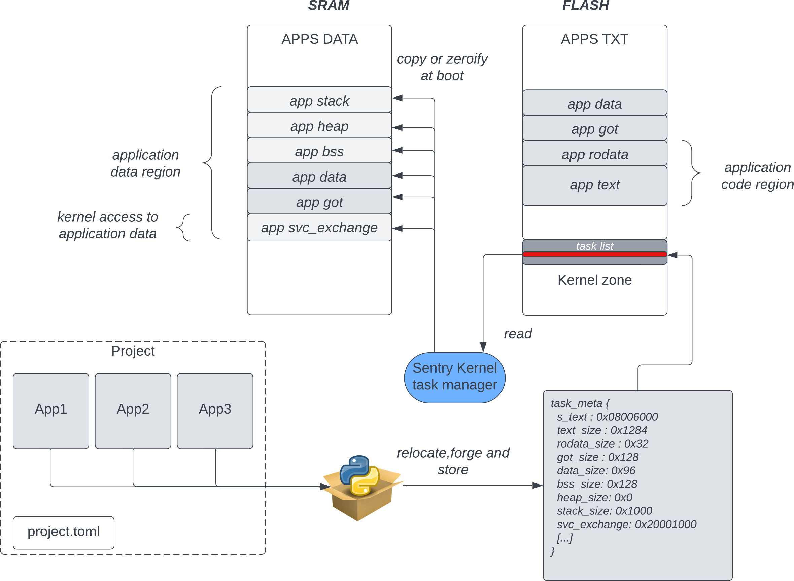

Task layout
-----------

.. _task_layout:

Introduction to generic task layout
"""""""""""""""""""""""""""""""""""

A task is composed, also in a embedded system, of the following main
elements:

   * **text section**: This section hold the task code. This section is the
     lonely part of the task that is executable. On embedded systems, this
     part is most of the time hold in flash memory as the flash is direct-mapped.

   * **rodata section**: this section hold the variable that are const (i.e. not
     mutable) at build time. It can be canonical strings, or const variables for
     example. This section is mapped read-only, and, in embedded system, kept in
     flash.

   * **data section**: this section hold global variables that are initialized out
     of any blocks, and as such need to be included in the final binary. As these
     variables are mutable, this section need to be copied in volatile memory so that
     the program can upgrade them.

   * **GoT Section**: the Global Offset Table is the section that hold relative
     address resolution mechanism that allow usage of PIC (Position Independent Code)
     executable. At boot time (or at build time in case of build-time address resolution)
     the GoT need to be updated in order to hold the correct symbol offsets so that
     the program properly resolve all its symbol, whatever its position in flash is.
     In Outpost OS, the GoT is updated at build time by the build system positioner.

   * **bss section**: The BSS hold the uninitialized data of a task. This section do
     not require to be stored in the final binary and thus in flash, but must exist in
     the volatile memory so that the task can manipulate its uninitialized variable properly

   * **heap**: when it exists, hold the allocator pool. In Outpost, allocator is
     fully userspace and under the responsability of the userspace library. Sentry only
     delivers, if needed, an empty space to hold a memory pool. The heap size is defined
     at task configuration time.

   * **stack**: runtime only too, hold the successive frames that define the current
     task context. Also hold the context saving frame when the task is scheduled.

Layout initialization at system startup
"""""""""""""""""""""""""""""""""""""""

Sentry kernel is responsible for initialize the job layout at startup time. For this,
the Sentry kernel do the following:

   * copy got section from flash to RAM
   * copy data section from flash to RAM
   * zeroify SVC-Exchange aread
   * zeroify bss area

The usage of Global Offset Table in Sentry allows support for relocations, which
gives the build system the ability to modify the position of application **after**
the application compilation and link time. This also allows reusability of
fully generic applications ELF files while the Sentry ABI retrocompatibility is
kept (same major version).

The task mapping is done based on the task metadata table forged by the build system
and included in the final firmware binary at a predefined section address.

As the task meatadata table is an external input content for Sentry kernel:

   1. the task metadata table aim to be kept authenticated using HMAC field To
      validate the metadata authenticity

   2. the task metadata ABI compliance is checked using a dedicated 64bit magic field
      that is unique to each project, and shared between the Sentry kernel configuration and
      the build system. This avoid any unvolontary corruption between projects

.. todo::

    add a more complete explanation about task_metadata struct and table

A typical application mapping at boot time is done as defined in the following:

   Example of application mapping at boot time

.. note::
    For more information on the way the build system manipulate applications, forge
    metadata information or store metadata in ELF files, see Outpost buid system documentation
