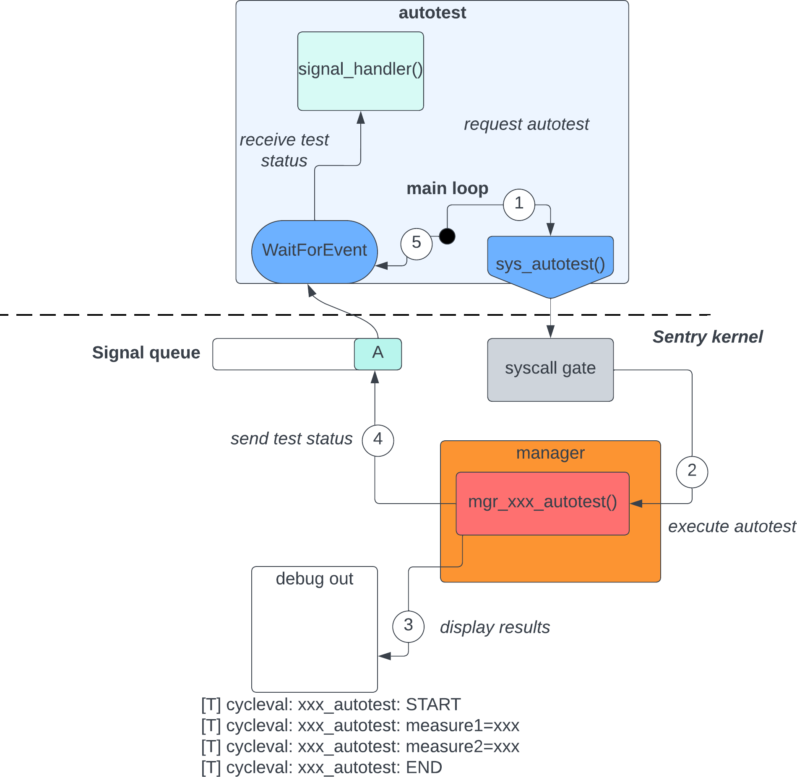

Sentry Autotest mode
--------------------

.. _autotest:

.. index::
    single: autotest; model
    single: test; autotest test model
    single: autotest API; model
    single: autotest API; definition

About Autotest
""""""""""""""

Autotest is a test methodology using a dedicated task built in order
to requires various Sentry kernel autotest methods execution.

The goal of the autotest mode is to validate various kernel subsystems, mostly
managers, in order to validate runtime-related

To control the autotest mode from the autotest application, the Sentry kernel include,
in autotest mode exclusively, a dedicated syscall denoted `sys_autotest()`, with the following API:

.. code-block:: C

    typedef enum autotest_request {
    SENTRY_AUTOTEST_ENTER  = 1,             /**< enter autotest mode */
    SENTRY_AUTOTEST_LEAVE,                  /**< leave autotest mode */
    SENTRY_AUTOTEST_CALL_MGR_CLOCK,         /**< ask for clock mgr autotest */
    SENTRY_AUTOTEST_CALL_CHECK_MGR_DEBUG,   /**< ask for debug mgr autotest */
    SENTRY_AUTOTEST_CALL_MGR_DEVICE,        /**< ask for device mgr autotest */
    SENTRY_AUTOTEST_CALL_MGR_INTERRUPT,     /**< ask for interrupt mgr autotest */
    SENTRY_AUTOTEST_CALL_MGR_IO,            /**< ask for IO manager autotest */
    SENTRY_AUTOTEST_CALL_MGR_MEMORY,        /**< ask for IO memory autotest */
    SENTRY_AUTOTEST_CALL_MGR_SECURITY,      /**< ask for security manager autotest */
    SENTRY_AUTOTEST_CALL_MGR_TASK,          /**< ask for task manager autotest */
    SENTRY_AUTOTEST_CALL_SCHED,             /**< ask for scheduler autotest */
    } autotest_request_t;

    sys_return_t sys_autotest(autotest_request_t command);

Runtime kernel testing
""""""""""""""""""""""

Autotest is built for two main usages:

   * testing manager behavior and performances in nominal usage. The goal is
     to get back test measurements of various Sentry kernel components directly
     on board (or on the targetting SoC), to get back some measurements on various
     testable values that need to be executed on target
     this is done through the usage of the `call` command set of the API, that ask
     a kernel module to execute its own autotest and return the result

   * testing invalid behavior kernel response, ensuring kernel hardening triggering
     to various userspace based invalid transmission. That later case verify that
     the various security triggers are being executed as expected.
     This is done using the enter/leave commands, that change the kernel behavior
     when executing all sanitation and security related functions starting at the
     `ENTER` command, and upto the `LEAVE` command.

To support both these usage, the Sentry kernel autotest API has been designed, in
association with the autotest application, for a flexible autotest activation/deactivation
model.

When being autotested, the kernel communicate with the autotest application
using specially crafted signals that only exist in autotest mode. These signals
are emitted by the kernel to the autotest application, which can receive them in the
very same way it receives all signals: through the sys_waitevent syscall.

The only difference here is that the signal source is the kernel (source id being `0`),
and the signal value is not a standard signal but one of the autotest specific signals,
as defined in the UAPI signal header:

.. literalinclude:: ../../../uapi/include/uapi/types/types.rs
   :language: rust
   :lines: 242-279
   :caption: List of autotest-specific signals

Autotesting kernel components
^^^^^^^^^^^^^^^^^^^^^^^^^^^^^

Autotesting Sentry module is as easy as a syscall pair:

A typical usage of such an autotest is, for example, a performance measurement of
the kernel random source:

.. code-block:: c
  :linenos:
  :caption: Entropy performance measurement through autotest

  kstatus_t mgr_security_autotest(void)
  {
    // [...]
    pr_autotest("START execute 256 entropy generation from entropy source");
    /* executing 256 random seed requests */
    for (uint32_t i=0; i < 256; ++i) {
        start = systime_get_cycle();
        if (unlikely(mgr_security_entropy_generate(&seed) != K_STATUS_OKAY)) {
            failures++;
        }
        stop = systime_get_cycle();
        uint64_t duration = stop - start;
        if (duration > max) {
            max = duration;
        }
        if ((min == 0) || (duration < min)) {
            min = duration;
        }
        average += duration;
    }
    /* average div 256 */
    average >> 8;
    pr_autotest("entropy_generate min time: %llu", min);
    pr_autotest("entropy_generate max time: %llu", max);
    pr_autotest("entropy_generate average time: %llu", average);
    pr_autotest("entropy_generate failures: %llu", failures);
    pr_autotest("END");

    return status;
  }

Kernel autotests logging
^^^^^^^^^^^^^^^^^^^^^^^^

As shown is the previous code sample, Sentry kernel autotest function use a
specially crafted log output for test execution, in order to allow kernel
logging post-processing.

The kernel autotest dediacated logging is using the `pr_autotest()` API, which
work in a very similar way to other `pr_` API of the debug manager:

.. code-block:: c
   :linenos:
   :caption: Autotest dedicated kernel logging API

   /** @def autotest log prefix */
   #define KERN_AUTOTEST   "[T]"
   /**
    * @def pr_ auto format string for pr_autotest only, adding TEST and current timestamping in u64
    * format
    */
   #define pr_autotest_fmt(fmt) "%lu%lu: %s: " fmt "\n", systime_get_cycleh(),systime_get_cyclel(), __func__
   /**
    * @def autotest messages, for autotest functions only
    */
   #define pr_autotest(fmt, ...) \
   	printk(KERN_AUTOTEST " " pr_autotest_fmt(fmt), ##__VA_ARGS__)

With such an API, test output formatting is automatically generated.

.. warning::

  The usage of autotest logging is acceptable in handler mode for autotest use case only,
  when IRQ events are under control of the test suite. huge autotest logging highly increase
  uninterruptible kernel sequence and must be considered at test design time

.. note::

  The Sentry kernel logging is voluntary IRQless and can be called in handler mode. Although,
  it should not be used in the middle of performances measurement loop without impacting it

Autotest application
^^^^^^^^^^^^^^^^^^^^

Autotest application is a dedicated application that is made to check the overall kernel UAPI.
Autotest app hold a dedicated, small footprint test suite mechanism using a test library
based on multiple macros so that an efficient pretty printing is delivered to the kernel log
in order to be CD-compliant

.. note::

  A typical usage of the autotest mechanism is through a continuous delivey targetting a test farm
  representative of the supported SoC(s), in which all the kernel UAPI is checked and the check
  report retreived

Autotest application check successively each syscall, and get back multiple informations on it,
including performances, effective security check tests (capability checking, etc.), and
resulted value analysis.

Autotest ``testlib`` is built to support the notion of:

   * test suite: a set of tests that check the same subcomponent
   * test: one or multiple calls that correspond to a given test

All tests and tests suites are executed consecutively. autotest do not stop on error, but instead
delivers all informational messages for both successful and failing tests.

Defining a test
"""""""""""""""

A typical basic test looks like the following the following:

.. code-block:: C

    TEST_START();

    micro_st = sys_get_cycle(PRECISION_MICROSECONDS);
    copy_to_user((uint8_t*)&micro, sizeof(uint64_t));;

    ASSERT_EQ(micro_st, STATUS_OK);
    ASSERT_GT((int)micro, 0);

    TEST_END()

Multiple assertion macros and logging tooling has been defined as testbed helpers.

Testlib for autotest
^^^^^^^^^^^^^^^^^^^^

Testlib is a small footprint testing library that aim to be executed on-target.
A small set of usual test helper functions and macros are defined.

Boolean expressions assertion is supported:

.. code-block:: c
   :caption: testlib assertion API

   /* check that numeric values are equal */
   ASSERT_EQ(a,b);
   /* check that numeric values are different */
   ASSERT_NE(a,b);
   /* check that a is bigger or equal to b */
   ASSERT_GE(a,b);
   /* check that a is smaller or equal to b */
   ASSERT_LE(a,b);
   /* check that a is bigger than b */
   ASSERT_GT(a,b);
   /* check that a is smaller than b */
   ASSERT_LT(a,b);
   /* check that a is in [b,B] range (b <= a <= B) */
   ASSERT_IN_RANGE(a,b,B);

Generic helpers for test and test suites declaration are defined

.. code-block:: c
   :caption: testlib generic test API

   /* starting a test. The current function name is used as identifier */
   TEST_START()
   /* stoping a test. The current function name is used as identifier */
   TEST_END()
   /* starting a test suite. The suite name is the given string argument */
   TEST_SUITE_START("mysuite")
   /* stoping a test suite */
   TEST_SUITE_END("mysuite")

Some generic API for pretty printing and complementary information delivery is supported:

.. code-block:: c
   :caption: testlib informational API

   /*log the given printf fmt-formatted arguments (printf compatible) */
   LOG("hello %lu", myvalue);

About tests and capabilities
""""""""""""""""""""""""""""

By now, autotest capabilities is build-time fixed. The goal is to use the autotest-dedicated
syscall in order to support dynamic capabilities in autotest mode only, in order to test
capability checks with multiple capability set successively.

.. note::

  The dynamic capability check is not yet supported
