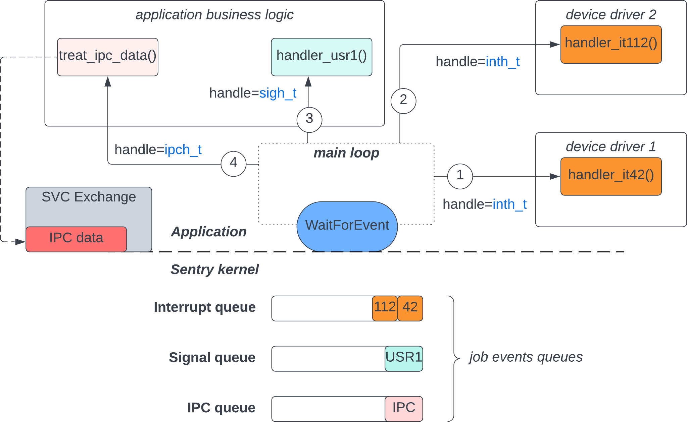
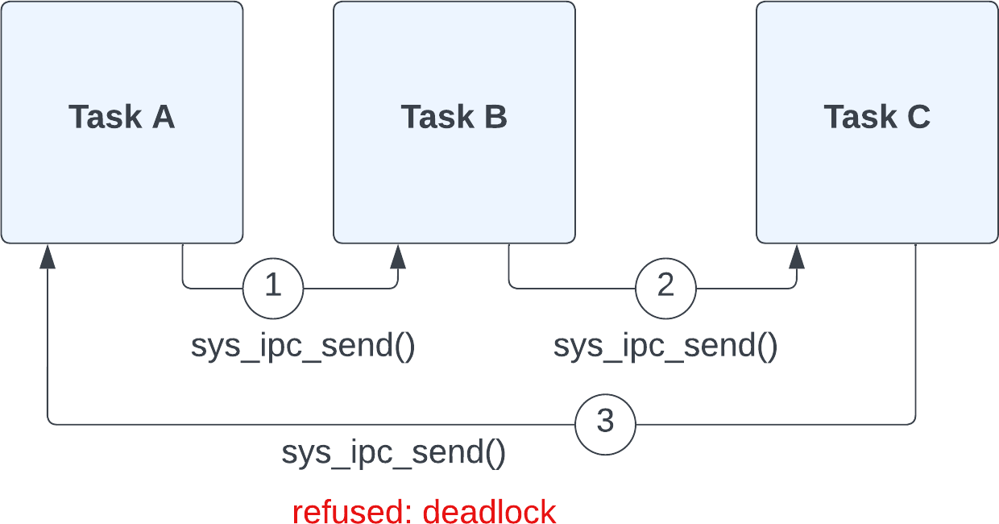

UAPI model
----------

.. index::
  single: UAPI; model
  single: UAPI; definition

UAPI introduction
"""""""""""""""""

The Sentry kernel is designed in order to deliver an easy to use, generic and
portable UAPI. This UAPI is written as a Rust crate and is defined using a dedicated ``uapi``
namespace.

The Rust crate is also built as a static library with a delivered C interface for
C usage, starting with the libshield POSIX implementation C library.

As the overall UAPI is written in Rust, the Sentry UAPI documentation (i.e. Sentry
application developer interface specification) is generated through
`RustDoc <https://doc.rust-lang.org/rustdoc/what-is-rustdoc.html>`_

UAPI abstraction
""""""""""""""""

The Sentry UAPI is not built to be used directly by userspace task, even if it
remains possible. The UAPI Rust crate is designed to be associated to:

   * a full Rust ecosystem including libCore and libStd for Rust developments
   * libShield, as a POSIX PSE51-2001 implementation (in Rust too, but exporting POSIX C API)
     for C runtime

Using standard abstractions allows userspace code to stay portable, making easier
userspace code testing and debugging.

.. index::
  single: handle; userspace usage
  single: irqh_t; userspace usage
  single: sigh_t; userspace usage
  single: ipch_t; userspace usage
  single: taskh_t; userspace usage

A little more about handles
^^^^^^^^^^^^^^^^^^^^^^^^^^^

.. _uapi_handles:

:ref:`Handles <handles>` list has been defined, but its usage needs to be described
a little more.

From a userspace task point of vue, ressources are manipulated through handles that
are homogeneous-sized opaques that identify the ressource when communicating with
the kernel.
This handles, also hold all required informations for main ressource manipulations.

Interrupt handle
~~~~~~~~~~~~~~~~

The interrupt handle is used to idenify a hardware interrupt. It hold the interrupt
unique identifier that can be retreived from the UAPI library directly that correspond
to the effective IRQ number on the target platform.
This allows the task to dispatch the event toward the corresponding handler when using
multiple drivers with multiple interrupt handlers.

.. todo::
  implement the `uapi_inth_get_num(irqh_t)` function

Signal handle
~~~~~~~~~~~~~

.. _signals:

The signal handler identify both the signal source and the signal identifier. The signal
source can be the kernel itself or a task allowed to communicate with the current job.

Multiple signals are supported, which allows easy signal handling for most of the
events that can impact the lifecycle of the embedded system. The supported signal
are voluntary a subset of the standard POSIX signal definition to help developer with
the usage of the signal set. Supported signals are the following:

.. code-block:: C
  :linenos:
  :caption: Sentry supported UAPI signal list

  typedef enum Signal {
    SIGNAL_ABORT,
    SIGNAL_ALARM,
    SIGNAL_BUS,
    SIGNAL_CONT,
    SIGNAL_ILL,
    SIGNAL_IO,
    SIGNAL_PIPE,
    SIGNAL_POLL,
    SIGNAL_TERM,
    SIGNAL_TRAP,
    SIGNAL_USR1,
    SIGNAL_USR2,
  } Signal;

When receiving a signal, the job receive the signal handle `sigh_t`. It can then
get back the source and the signal identifier, and deduce the action to take.

.. todo::
  implement `uapi_sigh_get_source(sigh_t)` and `uapi_sigh_get_signal(sigh_t)`

IPC handle
~~~~~~~~~~

IPC handles are ephemeral handles that are used when receiving and IPC message.
These handles hold the IPC lenght and source, allowing the task to get back
the IPC message from its own :ref:`SVC Exhcange <svc_exchange>` area and
process it. This handle is a reception handle only. Sending IPC is done by
passing the IPC message length and the target task handle to the `SendIPC`
syscall directly.

Task handle
~~~~~~~~~~~

A task handle is a semi-dynamic handle that hold two main informations:

   * the task label, which is unique in the system but static since boot time
   * the job identifier, which may vary if the task executes multiple consecutive
     jobs

As this is a semi-dynamic handle, when a job is manipulating that handle
(typically in order to communicate with a remote job), it is automatically informed
in case of the termination of the remote job, as the task handle used do not
correspond no more to any existing job on the system.

Task developpers are aware of task labels (a 16 bit unique identifier that is
defined at source-level of each task). This allows developpers of different
tasks that need to communicate to use this label in the task sources to
get back, at runtime, the current task handle of the peer's current job,
using the `GetTaskHandle` API.

In case of peer respawn, another call to this API is required to get back an
uptodate handle and continue the communication.

.. note::
  semi-dynamic task handles allows an easy way to detect peer respawn and
  react in the current job business logic (automaton reset, etc...)

.. warning::
  when a job terminates, all sources of input events that have not been
  consumed by the job are informed by a BROKEN_PIPE signal with the terminated job
  associated task label as source, and if blocked (in case of SendIPC), made
  schedulable again

.. todo::
  Describes `shm` handles (shared memories), `dma` handles (DMA streams),
  `io` handles (GPIOs and pin config)

.. index::
  single: userspace events; model
  single: userspace events; implementation

Sentry events
^^^^^^^^^^^^^

.. _events:

The Sentry UAPI is built in order to allow an easy event-driven userspace implementation
with easy, well-known abstraction. It allows userspace implementation of POSIX API such as `poll()`,
`timer_create()`, `timer_set()`, `timer_get()` or `clock_gettime()`, which are
POSIX.1-2001 compliant API.

To do this, all events sources are using a single abstraction model using handles,
as defined in :ref:`handles <handles>` dedicated chapter. Handles are a unified mechanism
in order to support allow synchronisation mechanisms with multiple sources.
For example, a task can wait for multiple event sources at a time, such as interrupts, signals,
and IPC, and being unlocked automatically as soon as any of them have risen.

This is done using the `WaitForEvent` UAPI. As a job may have multiple events waiting
in the same time, the Sentry kernel define a predictable receive order, when executing this
syscall:

   * Interrupts have the higher priority
   * Signals have middle priority
   * IPC have low priority

For each event type, if multiple elements of the same event is waiting, the kernel returns
the events starting with the first that have risen (FIFO model). The syscall always return
only one event at a time.

   Receiving events with Sentry

While it is possible to listen to multiple event types at a time, events that are emitted
by a job are always unique. A job can only emit a single event once, the event being
a signal or an IPC.
Emitting and receiving IPC is made using the :ref:`SVC Exhcange <svc_exchange>` region of
each task between which IPC data is copied by the kernel.

Signals are non-blocking events, meaning that the job is not preempted by the emission of
a signal. As this API is non-blocking, only a single signal can be received by a task from
a single other task at once. If a job emit another signal to the same peer task, while the
first signal is not yet received, the syscall will return a SYS_RET_BUSY error, informing
that the peer has not yet read the previous signal.

On the other hands, IPC are blocking events. When emitting an IPC, the job is preempted and
will not be resheduled while the peer has not received the IPC. Once the peer receive the IPC,
the emitting job is scheduled again and will get out of the `SendIPC()` syscall.

Even in `SendIPC()` is a blocking call that seems to never fail at first, it may
fail though, if the kernel detect a direct or indirect deadlock, as described in the
following figure:

   IPC deadlock detection
