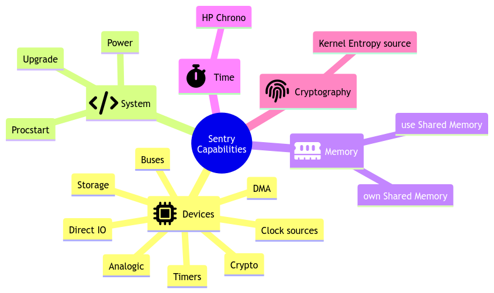

Initial conception model
------------------------

About general tasking model
^^^^^^^^^^^^^^^^^^^^^^^^^^^

Sentry is a preemptive kernel that execute partitioned userspace tasks.
Each task hold a single thread, built to use a single blocking point on which it
listens to various events:

   * hardware interrupts
   * inter-process communication
   * signals

The Sentry kernel has different schedulers, but the main production scheduler is
a Round-Robin multiqueue shheduler with quantum management.
Such a scheduler supports multiple queues (RRMQ) based on each task priority, and
manipulate each thread predefined quantum when the thread is spawn, defining the
duration of its CPU usage while elected.
A thread quantum is reset at various moments:

   * when the thread voluntary `yield()`
   * When the thread has consumed all its quantum and is removed from the eligible thread list
   * when the thread sleeps (TBD?)

When a thread is removed from the eligible threads list, it is moved to the list
of 'finished' thread and must wait for all other threads that still have some quantum to
finish before being eligible again. this is done by a simple table swap between eligible
and terminated threads when no more tasks is eligible but idle.

If no task at all is eligible (all tasks are waiting for an external event), idle task is
automatically executed, and make the processor entering sleep mode, waiting for any
project-configured external event of interrupt to awake.

Tasks properties
^^^^^^^^^^^^^^^^

Capabilities
""""""""""""

Accessing ressources is not based on permissions but instead on capabilities.
All ressources accesses a task would do in embedded system are accesses to
specific ressources (devices, system functions, etc.). All these ressources can
be considered as objects, to which access from tasks (subjects) is controlled by
the target object specific key the subject must possess. This is the initial
definition of the Bell-Lapadula RBAC model.

In Sentry, an *easy to inderstand* capabitility based model is implemented that
behave in such a way.
Here is the global Sentry capability model:

The capability hierarchy is ressource-oriented, with family definition that should
be easy to understand:

   * *Devices* for all hardware devices related ressources
   * *System* for all operating system related functions
   * *Memory* for all cold and hot storage accesses, including shared memories
   * *Cryptography*, for all operating-system based cryptographic ressources, such as
     entropy source(s)

Capabilities has been defined based on the security impact on the associated
ressource access. When developing an application, the user should easily know
what ressource is required by its own application using this hierarchy.

Spawning mode
"""""""""""""

Sentry supports multiple spawning and respawning modes, that need to be set
in the task configuration. There are two main spawning mode flags: the initial
spawn mode and the respawn mode.

   * Task initial spawn mode: a task can be configured to start at system
     bootup, or to be started only through another task request.
   * Task respawn mode: When a task finishes, it can specify multiple cases:

      * restart: restart on termination. The task is respawn, restarting with a
        fully fresh context
      * panic: the task should had never terminated. This is an abnormal behavior.
        The system must panic on this event
      * nothing: the task has just terminated, nothing special to do

Action on termination
"""""""""""""""""""""

A task has different termination cases:

   * normal termination, using `sys_exit()` syscall or `_exit` POSIX API
   * anormal termination, due to any fault

The kernel handle both exit cases differently:

   * In case of normal termination, the kernel check the task flags as defined in the
     previous chapter.
   * In case of fault, the kernel call the runtime sysabort handler. This handler
     is a runtime implementation. If the application developer has defined and
     declared a custom handler for this case, the runtime sysabort handler will
     call the task custom handler **after** its own execution. When the sysabort
     handler execution is executed, the task is in a dedicated state associated to it.
     If another fault rise while executing the abort handler, the system panic for
     security.

Tasks entrypoint
^^^^^^^^^^^^^^^^

In C mode The task thread entrypoint is the usual `int main(void)` function, as defined
in the ISO C definition. In full Rust, the main function is the usual `fn main()` function.

There are no specific runtime manual initialization to define in the userspace task,
as the Outpost OS and Sentry kernel do not directly call the `main` function but instead
use the standard `_start` symbol of the userspace runtime that is responsible for the
userspace task initialization. This avoid any supplementary, potentially buggy,
requirements on the user application developer. This function, to start with, initiate
the stack smashing protection of the userspace thread.

This allows to write userspace threads as simple as:

.. code-block:: C

   int main(void)
   {
        printf("Hello world!");
        do {
            /* my task loop... */
        } while (1);
        return 0;
   }
